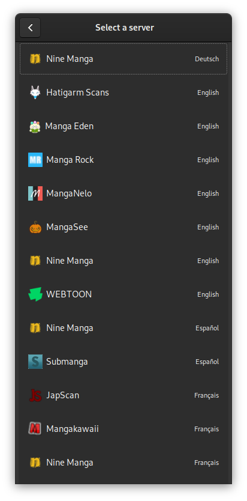
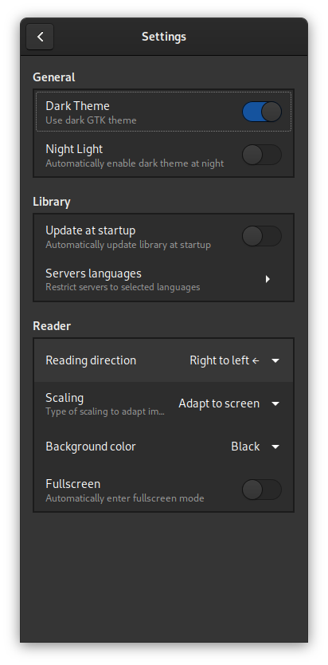

# This is a personal fork of [Komikku](https://www.gitlab.com/valos/Komikku)

This is a fork of Komikku and NOT the official repo. It will almost definitely have issues and the git log will always remain a mess. The `master` branch is forced to remain in sync with the upstream `master` branch so that I can branch off of it and make merge requests (yeah, i know that's not good). The `personal` branch is where I make my changes. Most of the time, both upstream and this branch are **essentially the same** because I try to upstream all the working changes asap and I also create patches and then stash away the more "experimental" changes.

Basically, don't use this.

Differences right now:

* Added a Makefile ([ae0c1731](https://gitlab.com/TAAPArthur/Komikku/-/commit/ae0c17311bf81505431687e1d21b560d76a4eb82) by TAAPArthur, improved greatly in [333594e](https://gitlab.com/lastweakness/Komikku/-/commit/333594e1aa5e5cfb8ce29854f3206412404a88ad))
* Enabled DeepSource analysis ([](https://deepsource.io/gl/lastweakness/Komikku/?ref=repository-badge))
* Some fixes suggested by DeepSource (I don't think it really matters much. See [e8b1faa1](https://gitlab.com/lastweakness/Komikku/-/commit/e8b1faa1068bd605a42a72c9afefc1fee7c77402), [c70a97ff](https://gitlab.com/lastweakness/Komikku/-/commit/c70a97ff7b43098225137c1916fb20f3c7c131e5), [7b704451](https://gitlab.com/lastweakness/Komikku/-/commit/7b7044514f32e2f74f3aabce4e26f224db5b96cc) and [ef69144d](https://gitlab.com/lastweakness/Komikku/-/commit/ef69144da658029dfec323ff62deca3721afad82))
* This README file.

The actual README follows. It's mostly the same as the official README.

#  Komikku

[](https://gitlab.com/lastweakness/Komikku/commits/personal)
[](https://stopthemingmy.app)

An online/offline manga reader for [GNOME](https://www.gnome.org), developed with the aim of being used with the *Librem 5* phone.

**PLEASE NOTE**: *Komikku* is still in **an early stage of development**. Some design changes or unexpected errors may lead to data loss (even if everything is done for them not to happen).

## License

Komikku is licensed under the [GPLv3+](https://www.gnu.org/licenses/gpl-3.0.html).

## Features

* Online reading from servers
* Offline reading of downloaded mangas
* RTL and LTR reading directions
* Light and dark themes

## Screenshots





## Installing

### Flatpak of development version

Setup [Flatpak](https://www.flatpak.org/setup/) for your Linux distro. Download the Komikku flatpak from the last passed [Gitlab pipeline](https://gitlab.com/valos/Komikku/pipelines). Then install the flatpak.

```bash
flatpak install info.febvre.Komikku.flatpak
```

## Building from source

### Option 1: Test or building a Flatpak with GNOME Builder

Open GNOME Builder, click the **Clone...** button, paste the repository url.

Clone the project and hit the **Play** button to start building Manga Scan or test Flatpaks with **Export Bundle** button.

### Option 2: Testing with Meson

Dependencies:

* `git`
* `ninja`
* `meson` >= 0.50.0
* `python` >= 3.6
* `gtk` >= 3.24.1
* `libhandy` >= 0.0.10
* `python-beautifulsoup4`
* `python-cloudscraper`
* `python-dateparser`
* `python-lxml`
* `python-magic`
* `python-pillow`
* `python-pure-protobuf`
* `python-unidecode`

This is the best practice to test Komikku without installing using meson and ninja.

#### First time

```bash
git clone https://gitlab.com/valos/Komikku
make
make local
```

#### Later on

```bash
make local
```

#### To Run

```bash
make run
```

### Option 3: Build and install systemwide directly with Meson

**WARNING**: This approach is discouraged, since it will manually copy all the files in your system. **Uninstalling could be difficult and/or dangerous**.

But if you know what you're doing, here you go:

```bash
git clone https://gitlab.com/valos/Komikku
cd Komikku
make
make install
```

If you've already used Option 2, do:

```bash
make clean
make
make install
```

## Translations

Helping to translate Komikku or add support to a new language is very welcome.

## Disclaimer

The developer of this application does not have any affiliation with the content providers available.
