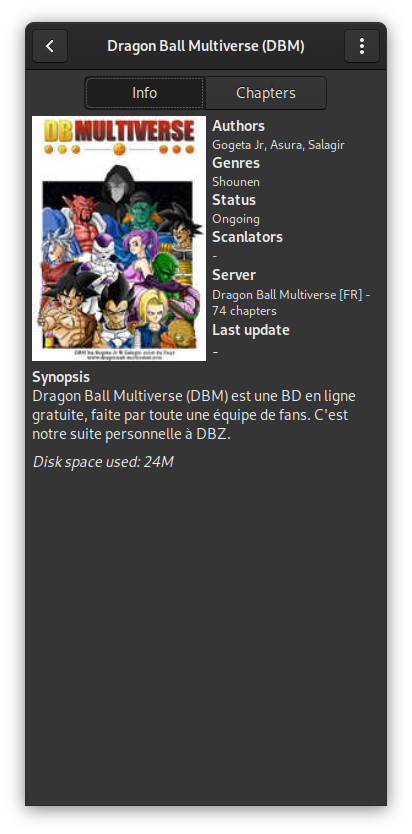
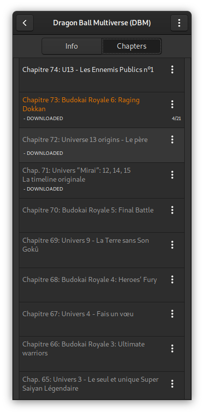

#  MangaScan

[](https://gitlab.com/valos/MangaScan/commits/master)

An online / offline manga reader for [GNOME](https://www.gnome.org), developed with the aim of being used with the *Librem 5* phone.

**PLEASE NOTE**: *MangaScan* is still in **beta**. Some design changes or unexpected errors may lead to data loss. Even if everything is done for them not to happen, sometimes it's unavoidable.

## License

MangaScan is licensed under the [GPLv3+](https://www.gnu.org/licenses/gpl-3.0.html).

## Features

* Online reading from servers
* Offline reading of downloaded mangas
* Light and dark themes

## Screenshots






## Building from source

### Option 1: Test or building a Flatpak with GNOME Builder

Open GNOME Builder, click the **Clone...** button, paste the repository url.

Clone the project and hit the **Play** button to start building Manga Scan or test Flatpaks with **Export Bundle** button.

### Option 2: Testing with Meson

Dependencies:

* `git`
* `ninja`
* `meson` >= 0.46.0
* `python` >= 3.5
* `gtk` >= 3.24.1
* `libhandy` >= 0.0.10
* `python-beautifulsoup4`
* `python-cloudscraper`
* `python-lxml`
* `python-pillow`
* `python-magic`
* `python-well`

This is the best practice to test MangaScan without installing using meson and ninja.

#### First time

```bash
git clone https://gitlab.com/valos/MangaScan
cd MangaScan
mkdir _build
cd _build
meson ..
meson configure -Dprefix=$(pwd)/testdir
ninja install # This will actually install in _build/testdir
ninja run
```

#### Later on

```bash
cd MangaScan/_build
ninja install # This will actually install in _build/testdir
ninja run
```

### Option 3: Build and install systemwide directly with Meson

**WARNING**: This approach is discouraged, since it will manually copy all the files in your system. **Uninstalling could be difficult and/or dangerous**.

But if you know what you're doing, here you go:

```bash
git clone https://gitlab.com/valos/MangaScan
cd MangaScan
mkdir _build
cd _build
meson ..
ninja install
```

## Translations
Helping to translate MangaScan or add support to a new language is very welcome.

## Disclaimer
The developer of this application does not have any affiliation with the content providers available.

## Authors
</> with &hearts; by Valéry Febvre
